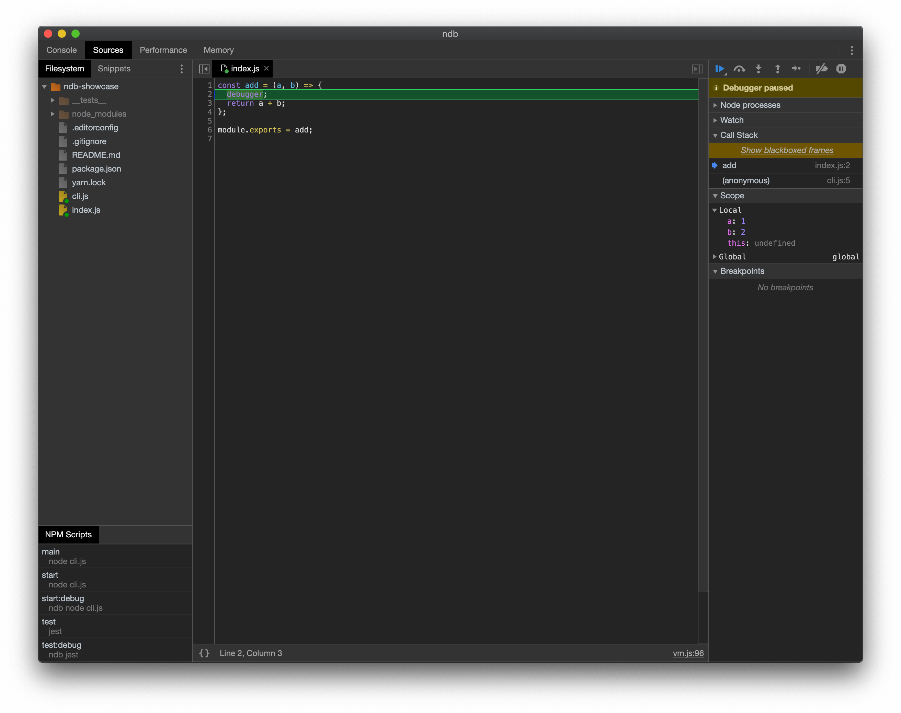
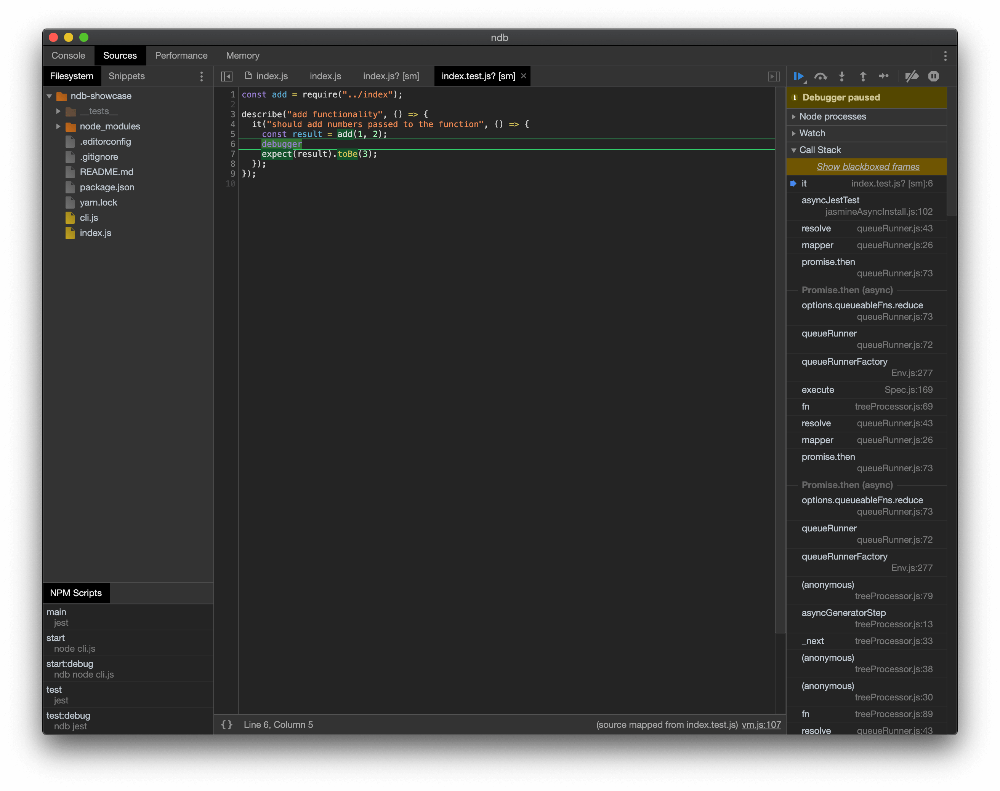

# ndb-showcase by <a href="https://github.com/igeligel">igeligel</a>

> A project to showcase project to show how to debug Node.js applications easily

## Showcase

## Contact

## License

_ndb-showcase_ is realeased under the
[MIT License](/License.md).
